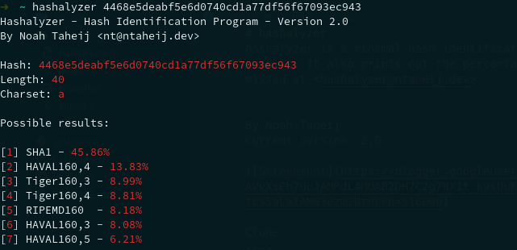

# hashalyzer
hashalyzer is a minimal hash identification tool written in C that uses a database to compare a hash's features to characteristics of other common hashing algorithm results. It also prints out the percentages of likelihood for each hashing alogirthm to be the one that produced the hash based on their popularity. Email hashes that I missed at <hashalyzer@ntaheij.dev>


By Noah Taheij
Current version: 2.0



Clone
----
```
git clone https://github.com/ntaheij/hashalyzer && cd hashalyzer/src
```

Build & install
----
```
sudo make install
```

Usage
---
```
hashalyzer [HASH]
```
or, alternatively you can use the interactive shell:
```
hashalyzer -s
```
You can exit with ^C.
